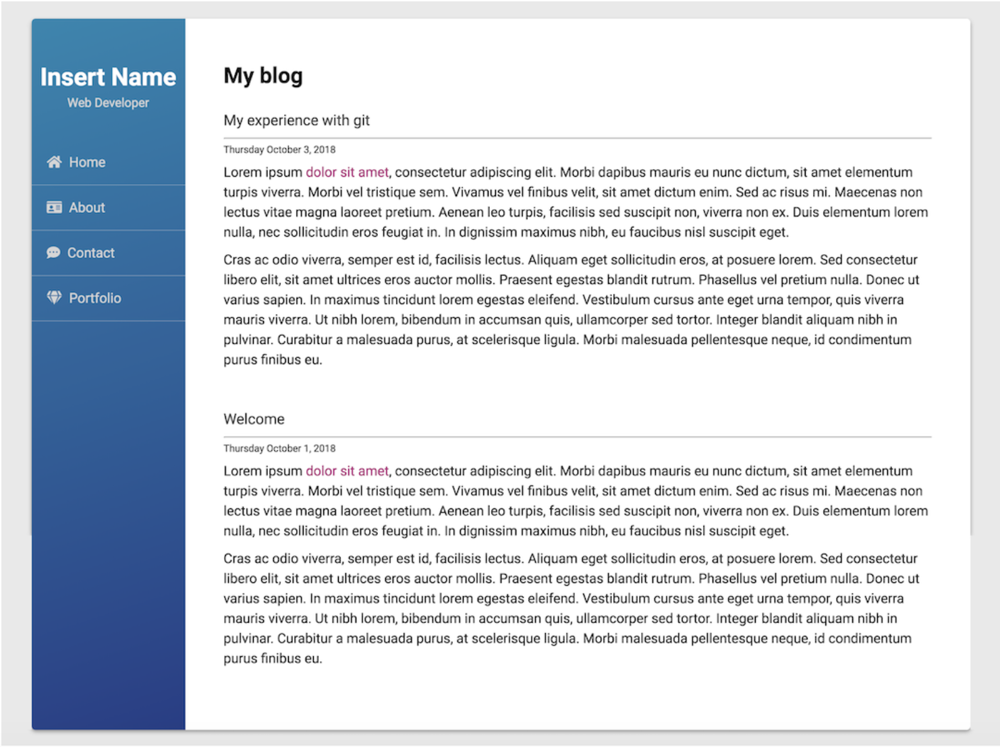

# Personal Blog #

Personal Blog mock up using HTML/CSS, to practice using various git commands and version control techniques used in the collaboration process.

  
<b>Other Tools & Languages:</b> 

## Table of Contents ##
<ul> 
  <li><a href="#about"> About </a></li>
  <li><a href="#technologies"> Built With </a></li>
  <li><a href="#setup"> Getting Started </a></li>
  <li><a href="#usage"> Deployment </a></li>
  <li><a href="#contact"> Contact</a></li>
</ul>

 

## About ##
I built this blog app as a way to learn Git and GitHub. Going forward I'll keep it up to date with my current information and occasionally write blog posts.

Check back soon!

 

## Built With ##
This personal blog integrates the following: 
<ul><a href="#">GitHub & Git commands</a></ul>

-------

 

## Getting Started ##
-----

### Set Up Database ###

------

 

## Deployment ##
This live project can be view at: ----

### Screenshots ###

 

## Contact ##

<ul>
  <li><a href="http://robynwang-portfolio.herokuapp.com/" target="_blank">Portfolio</a></li>
  <li><a href="https://www.linkedin.com/in/tyrobynwang" target="_blank">LinkedIn</a></li>
  <li><a href="https://github.com/robynwang314" target="_blank">GitHub</a></li>
</ul>

